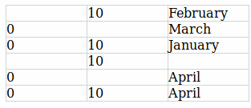

# vue-editable-cell



## Demo

TODO push on Netlify

To run it locally clone this repo and:

``` bash
cd demo
yarn
yarn serve
```

## Install

TODO push on NPM

Meanwhile you can import it directly from this repo:

``` bash
yarn add https://github.com/lucasbiguet/vue-editable-cell.git
```

Then import the component:

``` js
import EditableCell from 'vue-editable-cell'
```

## Usage

The components works on any regular table and requires a TD element as target

**The table rows must be of equal heights !**

``` js
<EditableCell
  :target="focusedTd"
  :value="editableValue"
  :options="selectOptions"
  @change="updateData"
  @drag="applyValueToAdjacentRows"
/>
```

TODO list and explain props

## Improvements

This package is in very early stage of development, features are missing:

- Drag n drop horizontally
- Style customisation via props
- Write tests
- Improve documentation
- Handle rows / col sizes dynamically
